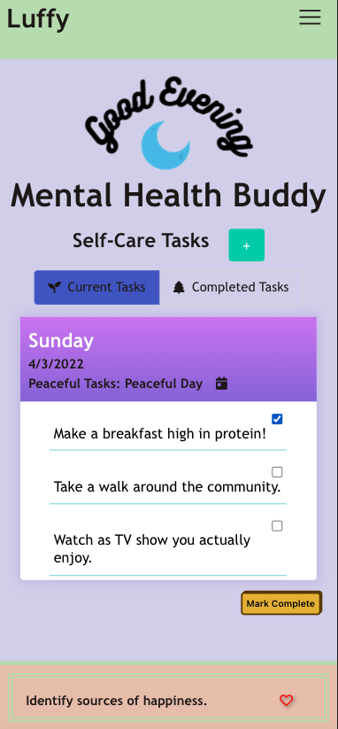

# Mental Health Buddy

Created By: Richard Huffman, Kaylan Prophet, Malik Spruill, Jordan Weston
 
 

Send yourself gentle mental health messages using Mental Health Buddy! 
Choose the type of message: advice slips, dad jokes, zen quotes, stoicism quotes, and Kanye quotes. You will be greeted by a new message every time you open the app or refresh the page. Save your favorite messages to your personal favorites list! 

Mental Health Buddy also helps you manage alll your self-care needs throughout the day. Create a handy To-Do List to keeps track of the items on your plate and the ones you've completed.

While reminding you of all your tasks you can personalize your app color scheme to your favorite colors or soothing tones that will help motivate you during your daily routine.

## Usage
* Access the deployed webapp at [https://chardmuffin.github.io/mental-health-buddy/](https://chardmuffin.github.io/mental-health-buddy/)
* Upon opening the app for the first time, you will be asked to select your prefences: 
    * Enter your name
    * Use the check boxes to select that type of content you'd like to see each time you visit the app
    * To personalize your color scheme to suit your tastes
    * You must enter your name and select at least one type of content to use the app
 
 

* In the upper right corner, you can tap the three horizontal lines to access the menu. From there you can view your favorited messages, edit your prefences (including name, content types, and color scheme), and view the about page.

* To add a new task push the green button with the "+", type your task and hit the save button to save your new task to your To-Do list, or hit the red cancel button to exit. To mark a task as complete select the task by clicking the check box to the right of the task and press the yellow "Mark Complete" button towards the bottom right of your To-Do list.

* To start you will only be able to add two tasks to your outstanding list. This is to prevent you from becoming overwhelmed with your day. In order to add more tasks to your To-Do list, you will need to start marking tasks as complete. Each task you complete 
will increase your maximum allowed number of outstanding tasks, up to 10.

* You can view all your completed tasks by clicking your "Completed Tasks" tab.

* To save a message to your favorites page, click the red heart icon to the right of the message. To view all your favorite meessages, navigate to your menu and click "Favorites". You will see a list of every message favorited. Unclick the heart icon to the right of a message you would like to unfavorite, and click the "Save Changes" button to update your favorites list.

* If you have favorited messages, you will have the option to choose "Favorites" as a content type in menu > "Settings". If you remove all your favorites then "Favorites" as a content type will be removed from your settings. If the only content type selected was "Favorites", your content will switch to "Zen Quotes" as default.

## App Preview

## Technologies Used
* HTML
* CSS & Bulma (CSS Framework)
* JavaScript/Jquery 
* APIS Used:
    * AdviceSlip - generate random pieces of advice - https://api.adviceslip.com/
    * Dad Jokes - generate random dad jokes - https://icanhazdadjoke.com/api
    * Zen Quotes - generates zen/philosophy quotes - https://zenquotes.io/
    * Stoicism quotes - quotes about stoicism - https://github.com/tlcheah2/stoic-quote-lambda-public-api
    * Kanye Quotes - generates Kanye quotes - https://kanye.rest/

## Resources
* Hamburger Menu inspiration from #6 in: https://alvarotrigo.com/blog/hamburger-menu-css/
* Font Awesome is used for user-friendly icons: https://fontawesome.com/

## License
[MIT](https://choosealicense.com/licenses/mit/)
